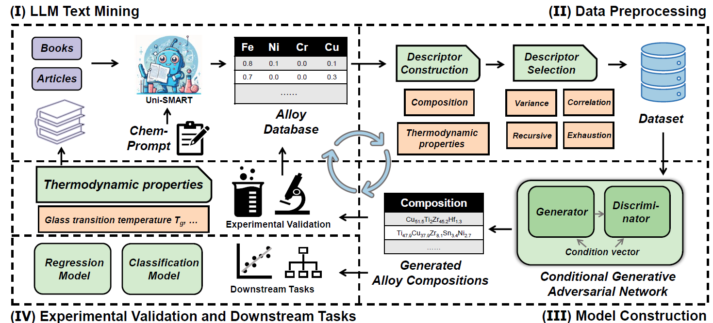
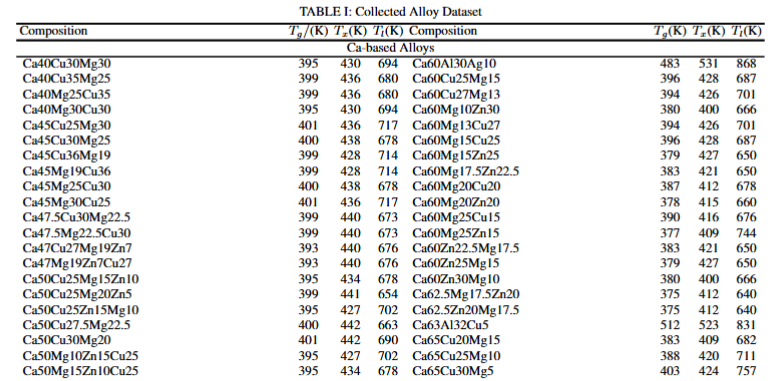
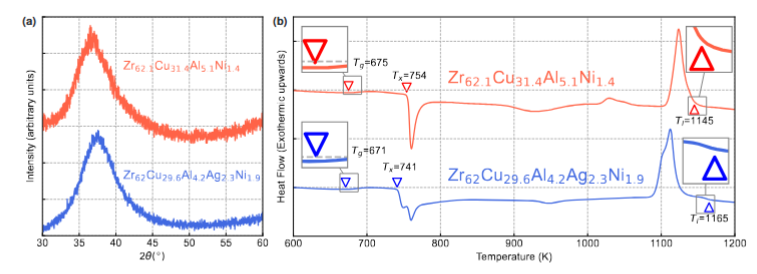
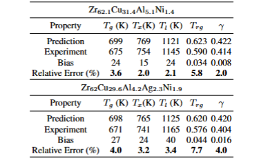

## Inverse Materials Design by Large Language Model-Assisted🚀 Generative Framework📈
Deep generative models hold great promise for inverse materials design, yet their efficiency and accuracy remain constrained by data scarcity. Here, we introduce AlloyGAN, a closed-loop framework that integrates Large Language Model (LLM)-assisted text mining with Conditional Generative Adversarial Networks (CGANs) to enhance data diversity and improve inverse design. Taking alloy discovery as a case study, AlloyGAN systematically refines material candidates through iterative screening and experimental validation. For metallic glasses, the framework predicts thermodynamic properties with discrepancies of less than 8\% from experiments, demonstrating its robustness. By bridging generative AI with domain knowledge and validation workflows, AlloyGAN offers a scalable approach to accelerate the discovery of materials with tailored properties, paving the way for broader applications in materials science.

## **Overall Architecture:** 

<p align="center">
  
  <br/>
  <br/>
</p>


## Installation

For installing, follow these intructions
```
conda create -n alloygan python=3.8
conda activate alloygan
pip install -r requirements.txt
```

## Data preparation 

The collected data in PDF format has been placed in the main directory`./Collected Alloy Dataset.pdf`. The complete Alloy dataset will be released later and made available for download.
<p align="center">
  
  <br/>
  <br/>
</p>

Extract them in the `datasets` folder.

 *Training*
 ---
Running training of GAN model and CGAN model on alloy dataset:


```
python main.py --model GAN --is_train True --download False   --dataroot datasets/alloys/   --dataset alloys  --epochs 100 --cuda True --batch_size 2

python main.py --model CGAN --is_train True --download False   --dataroot datasets/alloys/   --dataset alloys  --epoch 100 --cuda True --batch_size 2
```

Start tensorboard:

```
tensorboard --logdir ./logs/
```

## Results
<p align="center">
  
  <br/>
  <br/>
  <b> Experiment validation of two metallic glass candidates, Zr<sub>62.1</sub>Cu<sub>31.4</sub>Al<sub>5.1</sub>Ni<sub>1.4</sub> and Zr<sub>62</sub>Cu<sub>29.6</sub>Al<sub>4.2</sub>Ag<sub>2.3</sub>Ni<sub>1.9</sub>
 </b>
</p>
<p align="center">
  
  <br/>
  <br/>
  <b> Experimental validation of metallic glass candidates generated by the AlloyGAN framework.  </b>
</p>

